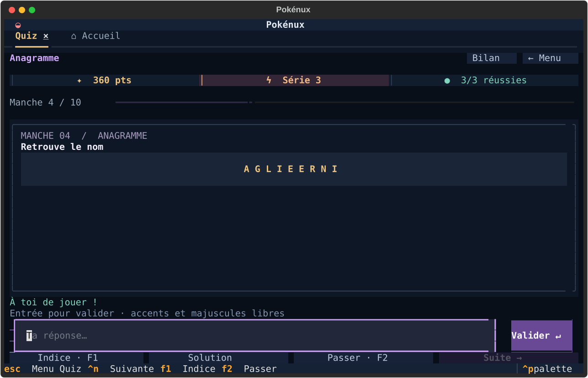

# Pokénux

**A little Pokémon adventure, right in your terminal.**

Browse the Pokédex, test your memory, discover cards, and build a virtual
collection. Pokénux brings four activities into a colourful, keyboard-friendly
Textual application, with local saves and no account to create.

*Un Pokédex, des quiz et une collection de cartes à explorer depuis votre terminal.*

[](LICENSE)
[](pyproject.toml)
[](https://textual.textualize.io/)

[Get started](#get-started) · [How to play](docs/usage.md) ·
[Changelog](CHANGELOG.md) · [Contribute](CONTRIBUTING.md)



## Choose your adventure

| Activity | What you can do |
| --- | --- |
| **Pokédex** | Search by name or number, combine generation and type filters, compare statistics, follow evolutions, and find related cards. |
| **Quiz** | Play surprise challenges, anagrams, silhouettes, rankings, and card quizzes. Build combos, use hints, and review your answers after a session. |
| **Cards** | Browse sets and artwork, search by name, HP, type, or illustrator, and inspect individual card editions. |
| **Boosters** | Earn virtual money, open packs, reveal your pulls, sell duplicates, and grow a collection saved between sessions. |

Choose **French or English** independently for the interface, Pokédex and TCG
in Settings. Changes apply to open tabs without restarting the app.

The layout adapts to smaller terminals. Use the mouse or keyboard; **1–4** on
the home screen opens an activity. Quiz answers accept French and English
Pokémon names and ignore accents and punctuation.

## Get started

**1.1.0 is in preparation.** The repository contains the release and packaging
tooling; publishing a release is a separate maintainer action. Linux packages
will appear on [GitHub Releases](https://github.com/FrancoisBasset/pokenux/releases)
once published.

To install the current source with [uv](https://docs.astral.sh/uv/):

```sh
uv tool install --python 3.14 git+https://github.com/FrancoisBasset/pokenux.git
pokenux
```

Python **3.14 or newer** is required for a source installation. The prepared
Linux `.deb`, Arch package, and portable archive bundle CPython and their Python
dependencies, so they do not require Python 3.14 from your distribution.
See [installation, updates, and removal](docs/installation.md).

On first launch, Pokénux downloads its catalogue. Text browsing and most text
quizzes then work locally; artwork and missing card details need a connection
when first requested. Your settings and collection stay in
`~/.local/share/pokenux/`. Booster money and prices are part of the game.

## What to expect

Pokénux is an actively evolving, Linux-first hobby project. Old catalogues can
lack translated metadata; Settings shows their status and offers updates.
New asset editions include French and English and have their own version.
The quiz score is currently per session. Image rendering depends on your terminal, and
external catalogue services can occasionally be unavailable.

There is no official Debian repository or AUR listing supplied by this project.
The package recipes and release workflow are available for contributors to
inspect and build themselves.

## Build something with us

Bug reports, translations, documentation improvements, accessible terminal
layouts, and small focused patches are all welcome.

```sh
git clone https://github.com/FrancoisBasset/pokenux.git
cd pokenux
uv sync --locked --dev
uv run pokenux
```

[Contributing](CONTRIBUTING.md) covers the development loop and checks.
The [roadmap](docs/roadmap.md) lists useful next steps without promising release
dates. For distribution builds, see the [release guide](docs/releases.md).
For bilingual catalogue builds and updates, see [versioned assets](docs/assets.md).

## Project information

- [Playing Pokénux](docs/usage.md) — controls, quiz scoring, and booster rules.
- [Support](SUPPORT.md) — troubleshooting and useful bug report details.
- [Security](SECURITY.md) — private vulnerability reporting.
- [Code of conduct](CODE_OF_CONDUCT.md) — how we work together.
- [Data and attribution](docs/data-and-attribution.md) — sources, local files, and third-party content.

Pokénux uses [Textual](https://textual.textualize.io/),
[Tyradex](https://tyradex.vercel.app/), and [TCGdex](https://tcgdex.net/).
The application code is available under the [MIT license](LICENSE).

This is an unofficial fan project, unaffiliated with Nintendo, Game Freak,
Creatures, or The Pokémon Company. Pokémon names, trademarks, artwork, and
third-party data remain subject to their respective rights; the code's MIT
license does not grant rights to those materials.
